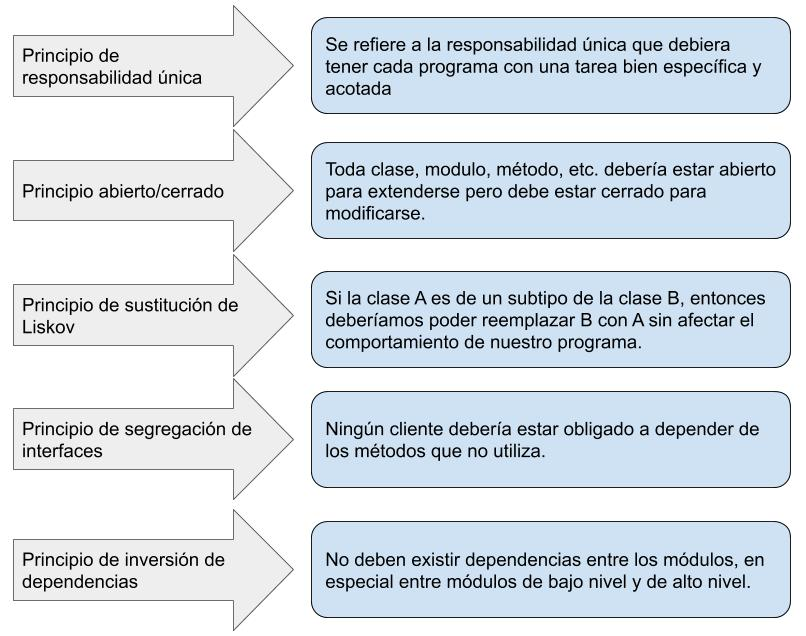
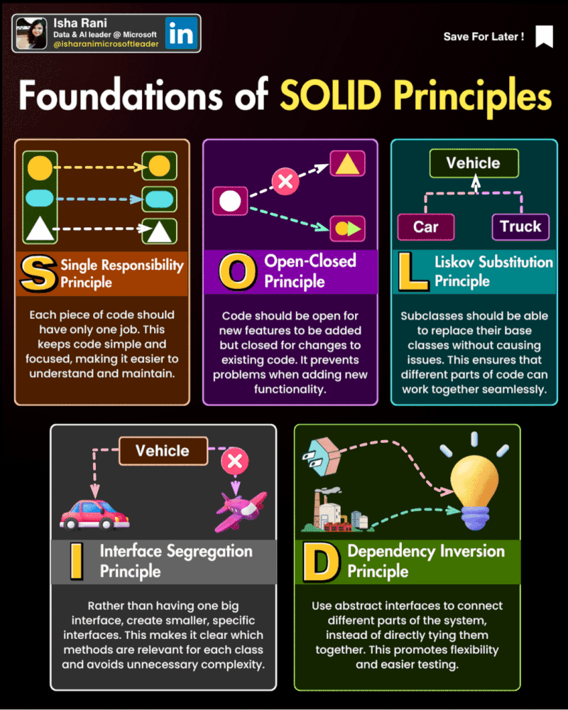
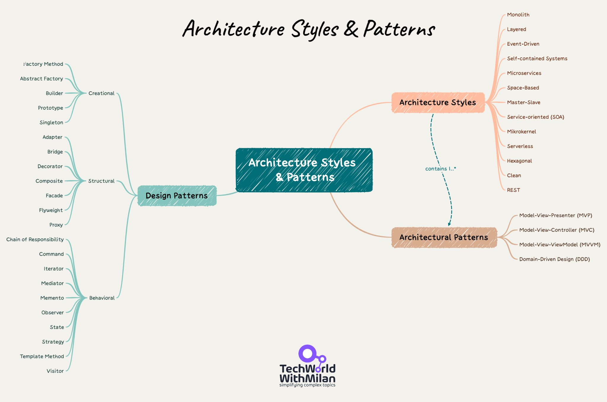
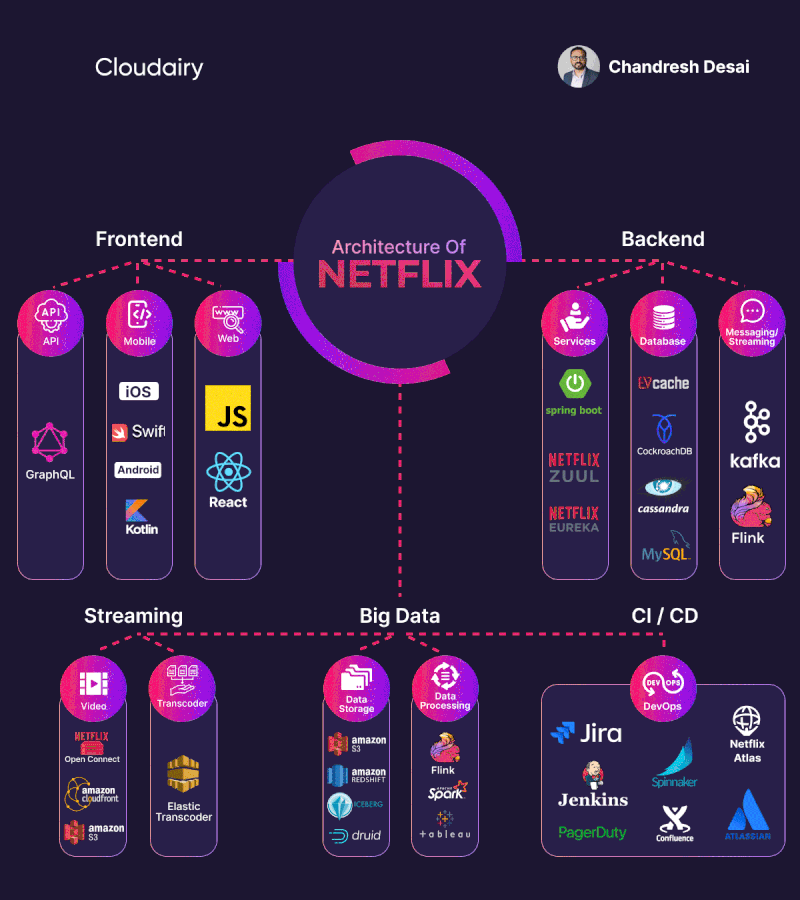
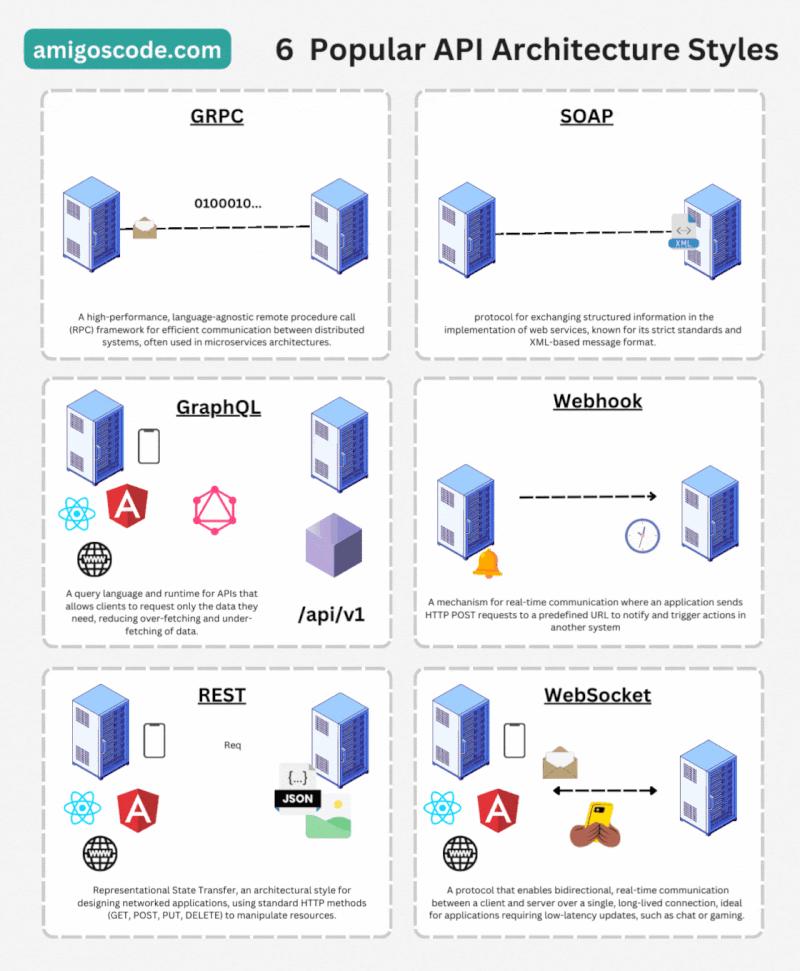

- [Patrones y tipos de arquitecturas en Servidor.](#patrones-y-tipos-de-arquitecturas-en-servidor)
  - [Principios SOLID](#principios-solid)
  - [Patrones de Diseño](#patrones-de-diseño)
  - [Arquitecturas Software](#arquitecturas-software)
  - [Ejemplo de arquitectura de Netflix](#ejemplo-de-arquitectura-de-netflix)
  - [API Web](#api-web)


## Patrones y tipos de arquitecturas en Servidor.

### Principios SOLID
Los cinco principios SOLID son un conjunto de reglas y mejores prácticas para el diseño de software orientado a objetos. 

[Video SOLID](https://www.youtube.com/watch?v=E_mSr-VFd3g)





Los principios son:

1. **Principio de responsabilidad única (Single Responsibility Principle, SRP)**: Una clase debe tener una, y solo una, razón para cambiar. Esto significa que una clase debe tener solo una tarea o responsabilidad.

    ```java
    public class Informe {
        public void generarInforme() {
            // lógica para generar el informe
        }
    }

    public class ImprimirInforme {
        public void imprimir(Informe informe) {
            // lógica para imprimir el informe
        }
    }
    ```

    En este ejemplo, la clase `Informe` solo tiene la responsabilidad de generar el informe, mientras que la clase `ImprimirInforme` tiene la responsabilidad de imprimir el informe.

2. **Principio abierto/cerrado (Open/Closed Principle, OCP)**: Las entidades de software (clases, módulos, funciones, etc.) deben estar abiertas para la extensión, pero cerradas para la modificación.

    ```java
    public abstract class Forma {
        abstract void dibujar();
    }

    public class Circulo extends Forma {
        void dibujar() {
            // lógica para dibujar un círculo
        }
    }

    public class Cuadrado extends Forma {
        void dibujar() {
            // lógica para dibujar un cuadrado
        }
    }
    ```

    En este ejemplo, la clase `Forma` está abierta para la extensión (se puede crear una nueva forma como `Circulo` o `Cuadrado`), pero cerrada para la modificación (no necesitamos cambiar la clase `Forma` para añadir una nueva forma).

3. **Principio de sustitución de Liskov (Liskov Substitution Principle, LSP)**: Los objetos de una superclase deben poder ser reemplazados por objetos de una subclase sin afectar la corrección del programa.

    ```java
    public class Pajaro {
        public void volar() {
            // lógica para volar
        }
    }

    public class Pinguino extends Pajaro {
        @Override
        public void volar() {
            throw new UnsupportedOperationException();
        }
    }
    ```

    Este es un ejemplo de violación del principio de sustitución de Liskov, ya que `Pinguino` es una subclase de `Pajaro`, pero no puede volar. Una solución sería tener una clase separada para pájaros que pueden volar.

4. **Principio de segregación de interfaces (Interface Segregation Principle, ISP)**: Los clientes no deben ser forzados a depender de interfaces que no usan.

    ```java
    public interface Pajaro {
        void comer();
    }

    public interface PajaroVolador {
        void volar();
    }

    public class Pinguino implements Pajaro {
        public void comer() {
            // lógica para comer
        }
    }

    public class Paloma implements Pajaro, PajaroVolador {
        public void comer() {
            // lógica para comer
        }

        public void volar() {
            // lógica para volar
        }
    }
    ```

    En este ejemplo, `Pinguino` no está forzado a implementar un método `volar()` que no necesita, ya que hemos segregado las responsabilidades en dos interfaces diferentes.

5. **Principio de inversión de dependencias (Dependency Inversion Principle, DIP)**: Los módulos de alto nivel no deben depender de los módulos de bajo nivel. Ambos deben depender de abstracciones.

    ```java
    public interface BaseDeDatos {
        void guardar(String datos);
    }

    public class MySqlDB implements BaseDeDatos {
        public void guardar(String datos) {
            // lógica para guardar datos en MySQL
        }
    }

    public class Aplicacion {
        private BaseDeDatos db;

        public Aplicacion(BaseDeDatos db) {
            this.db = db;
        }

        public void guardarDatos(String datos) {
            db.guardar(datos);
        }
    }
    ```

    En este ejemplo, la clase `Aplicacion` no depende directamente de la clase `MySqlDB`. En lugar de eso, ambos dependen de la abstracción `BaseDeDatos`. De esta manera, si queremos cambiar la base de datos en el futuro, solo necesitamos crear una nueva implementación de `BaseDeDatos`, sin tener que cambiar la clase `Aplicacion`.


### Patrones de Diseño
Un patrón de diseño de software es una solución generalmente aplicable a un problema común en el diseño de software. Los patrones de diseño proporcionan un enfoque probado y estructurado para resolver problemas recurrentes y mejorar la calidad y flexibilidad del código.

Existen varios tipos de patrones de diseño de software, entre ellos:

1. Patrones de creación: Estos patrones se centran en la creación de objetos de manera flexible y eficiente. Algunos ejemplos son: Singleton, Factory Method, Abstract Factory y Builder.

2. Patrones estructurales: Estos patrones se ocupan de la composición y estructura de las clases y objetos. Algunos ejemplos son: Adapter, Decorator, Composite y Proxy.

3. Patrones de comportamiento: Estos patrones se centran en la interacción y comunicación entre objetos. Algunos ejemplos son: Observer, Strategy, Template Method y Command.

4. Patrones arquitectónicos: Estos patrones abordan la estructura y organización de sistemas de software a gran escala. Algunos ejemplos son: Modelo-Vista-Controlador (MVC), Capas y Microservicios.

5. Patrones de concurrencia: Estos patrones se utilizan para gestionar la concurrencia y la comunicación entre hilos. Algunos ejemplos son: Mutex, Semaphore, Productor-Consumidor y Monitor.

Estos son solo algunos ejemplos de patrones de diseño de software. Cada patrón tiene un propósito específico y puede aplicarse en diferentes contextos para resolver problemas particulares en el diseño y la implementación de software.

Puedes aprenderlos en [Refactoring Guru](https://refactoring.guru/es/design-patterns) y [Entornos de Desarrollo 8](https://github.com/joseluisgs/EntornosDesarrollo-08-2022-2023).

### Arquitecturas Software
Una arquitectura de software se refiere a la estructura organizativa fundamental de un sistema de software. Define cómo se dividen, combinan y coordinan los componentes del software para lograr los objetivos del sistema. En el desarrollo de aplicaciones web del lado del servidor (backend), existen varias arquitecturas de software principales:



1. Arquitectura monolítica: Es un enfoque tradicional en el que todos los componentes de una aplicación web se agrupan en un solo bloque. La lógica de negocio, la interfaz de usuario y la capa de acceso a datos se encuentran dentro de la misma aplicación. Es fácil de desarrollar y desplegar, pero puede volverse complejo y difícil de mantener a medida que la aplicación crece. Características:
- Todos los componentes se ejecutan en el mismo proceso y comparten recursos.
- La escalabilidad puede ser un desafío, ya que la aplicación se ejecuta en una sola instancia.
- Los cambios en una parte de la aplicación pueden afectar a otras partes.

2. Arquitectura de capas: Esta arquitectura divide la aplicación en diferentes capas lógicas, donde cada capa tiene una responsabilidad específica. Las capas típicas incluyen la capa de presentación, la capa de lógica de negocio y la capa de acceso a datos. Cada capa se comunica con la capa adyacente a través de interfaces bien definidas. Características:
- Mejora la modularidad y la reutilización del código.
- Permite cambios en una capa sin afectar a las demás.
- Facilita la escalabilidad y el mantenimiento del sistema.

3. Arquitectura de servicios web: Esta arquitectura se basa en la comunicación entre diferentes servicios a través de protocolos web estándar, como HTTP. Cada servicio es una unidad independiente que se puede desarrollar, desplegar y escalar de forma independiente. Los servicios se comunican entre sí para cumplir con los requisitos de la aplicación. Características:
- Favorece la modularidad y la independencia de los servicios.
- Permite la integración de diferentes tecnologías y lenguajes de programación.
- Facilita la escalabilidad horizontal, ya que los servicios se pueden replicar y distribuir en múltiples servidores.

4. Arquitectura basada en microservicios: Es una evolución de la arquitectura de servicios web, donde los servicios se dividen en componentes aún más pequeños y autónomos llamados microservicios. Cada microservicio se enfoca en una tarea específica y se comunica con otros microservicios a través de protocolos ligeros. Características:
- Cada microservicio se puede desarrollar, desplegar y escalar de forma independiente.
- Mejora la flexibilidad y la agilidad del desarrollo.
- Permite la adopción de diferentes tecnologías y enfoques dentro de cada microservicio.

Estas son solo algunas de las arquitecturas de software más comunes en el desarrollo de aplicaciones web backend. Cada una tiene sus ventajas y desafíos, y la elección de la arquitectura adecuada depende de los requisitos y objetivos del proyecto.

### Ejemplo de arquitectura de Netflix
La arquitectura de backend de Netflix es conocida por ser altamente escalable y resiliente, diseñada para manejar grandes volúmenes de tráfico y garantizar la disponibilidad y el rendimiento de sus servicios. Netflix adopta una arquitectura basada en microservicios, donde las diferentes funcionalidades se dividen en servicios independientes. Cada microservicio se enfoca en una tarea específica y se comunica con otros servicios a través de interfaces bien definidas. Esto permite una mayor flexibilidad, escalabilidad y mantenimiento de los servicios individuales.



### API Web
Una API web (Application Programming Interface) es un conjunto de reglas y protocolos que permite a diferentes aplicaciones o sistemas comunicarse y compartir datos entre sí a través de la web. Proporciona un conjunto de funciones y métodos que permiten a los desarrolladores acceder y manipular los datos de una aplicación o servicio específico.

En el contexto de las aplicaciones web, una API web permite que el backend de una aplicación exponga ciertas funcionalidades y datos a otras aplicaciones o servicios, como aplicaciones móviles, sitios web o sistemas externos. Esto permite la integración y la creación de aplicaciones más complejas y robustas.

Las API web se basan en protocolos estándar de la web, como HTTP (Hypertext Transfer Protocol), y utilizan formatos de intercambio de datos como JSON (JavaScript Object Notation) o XML (eXtensible Markup Language) para enviar y recibir información.

Algunos ejemplos comunes de API web incluyen:

1. API RESTful: Es un estilo arquitectónico que utiliza los métodos HTTP (GET, POST, PUT, DELETE, etc.) para acceder y manipular recursos en un sistema. Se basa en la representación de recursos a través de URLs (Uniform Resource Locators) y utiliza formatos como JSON para el intercambio de datos.

2. API GraphQL: Es un lenguaje de consulta y una especificación para las APIs web. Permite a los clientes solicitar y recibir solo los datos necesarios, lo que mejora la eficiencia y reduce la cantidad de datos transferidos.
   
3. API Websocket: Utiliza el protocolo de comunicación de WebSockets para permitir una comunicación bidireccional y en tiempo real entre un cliente y un servidor a través de una conexión persistente. A diferencia de las API tradicionales basadas en HTTP, que siguen un modelo de solicitud-respuesta, las API con WebSockets establecen una conexión continua entre el cliente y el servidor, lo que permite una comunicación más eficiente y en tiempo real.

Las API web son fundamentales en el desarrollo de aplicaciones modernas, ya que permiten la integración de diferentes servicios y la creación de aplicaciones más flexibles y escalables.

