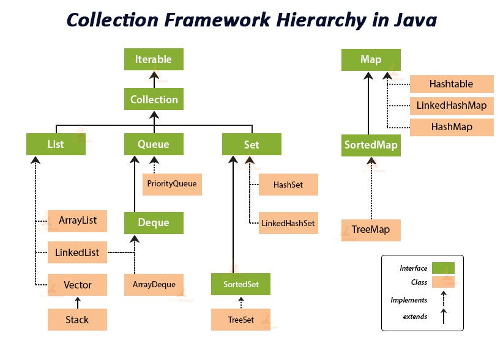
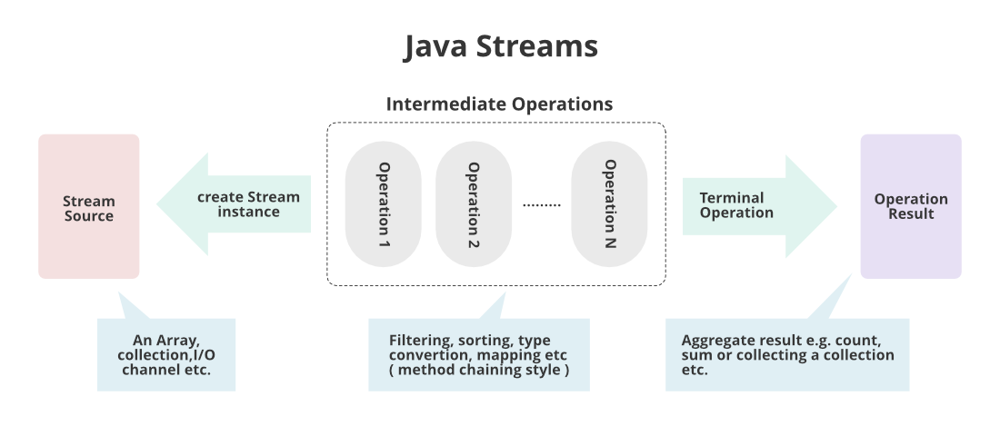
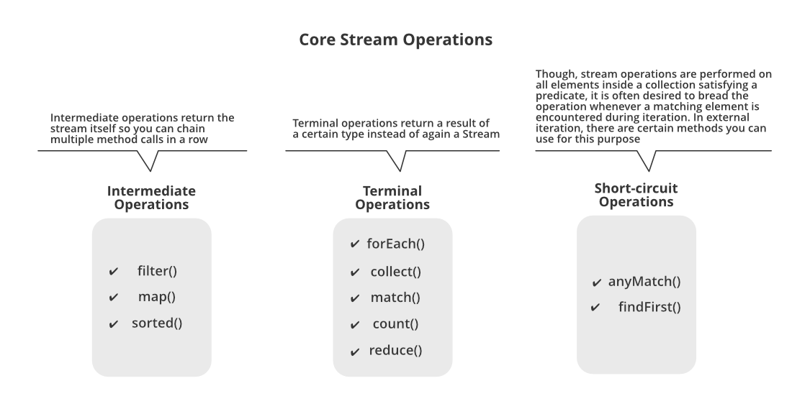
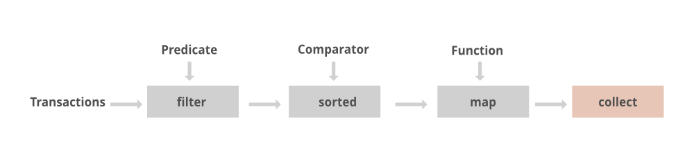
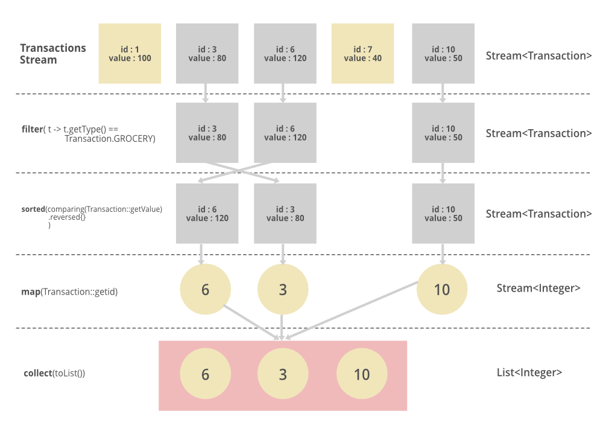
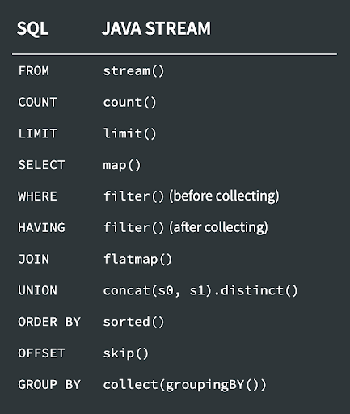

- [Tipos de Datos Abstractos. Colecciones. Programación Funcional](#tipos-de-datos-abstractos-colecciones-programación-funcional)
  - [Tipos de datos abstractos](#tipos-de-datos-abstractos)
  - [Programación con genéricos](#programación-con-genéricos)
    - [Varianza](#varianza)
  - [Colecciones en Java](#colecciones-en-java)
  - [Programación funcional en Java](#programación-funcional-en-java)
  - [Optional](#optional)
  - [Operaciones funcionales con colecciones](#operaciones-funcionales-con-colecciones)
    - [Ejemplos](#ejemplos)
    - [Paso a paso](#paso-a-paso)
    - [Similitudes con SQL](#similitudes-con-sql)


## Tipos de Datos Abstractos. Colecciones. Programación Funcional
### Tipos de datos abstractos
Un Tipo de Dato Abstracto (TDA) es un concepto en programación que se refiere a una estructura de datos que define un conjunto de operaciones y propiedades, pero oculta los detalles internos de implementación. Es decir, un TDA proporciona una interfaz clara y definida para interactuar con los datos, sin revelar cómo se almacenan o se manejan internamente.

Un TDA se compone de dos partes principales:

1. Interfaz: Define las operaciones que se pueden realizar con los datos y las propiedades que estos deben cumplir. La interfaz especifica qué operaciones se pueden realizar (métodos) y qué comportamiento se espera de los datos (propiedades). Por ejemplo, un TDA de una lista podría tener operaciones como "insertar elemento", "eliminar elemento" y "obtener tamaño".

2. Implementación: Es la forma en que se estructuran y almacenan los datos internamente para que las operaciones definidas en la interfaz puedan llevarse a cabo. La implementación está oculta para los usuarios del TDA, quienes solo interactúan con él a través de la interfaz.

El uso de TDAs permite abstraer la complejidad de la implementación de los datos, lo que facilita el desarrollo de programas y promueve la reutilización de código. Además, los TDAs ayudan a organizar y estructurar los datos de manera lógica, lo que mejora la claridad y mantenibilidad del código.

Algunos ejemplos comunes de TDAs son las listas, pilas, colas, árboles, conjuntos y mapas. Cada uno de estos TDAs tiene una interfaz específica que define las operaciones que se pueden realizar y las propiedades que deben cumplir. La implementación interna de cada uno de estos TDAs puede variar según las necesidades y restricciones del problema en cuestión.

### Programación con genéricos
La programación con genéricos en Java permite crear clases, interfaces y métodos que pueden trabajar con diferentes tipos de datos de manera segura y flexible. En lugar de especificar un tipo de dato concreto al definir una clase o método, se utiliza un parámetro de tipo genérico que se reemplaza por un tipo específico cuando se utiliza esa clase o método.

La sintaxis básica para definir una clase genérica en Java es la siguiente:

```java
public class NombreClase<T> {
    // Código de la clase
}
```

En este ejemplo, `T` es el parámetro de tipo genérico que puede representar cualquier tipo de dato. Puedes usar cualquier identificador como parámetro de tipo genérico, aunque generalmente se utiliza `T` para representar "tipo".

Para ilustrar el uso de genéricos, aquí tienes un ejemplo de cómo definir una clase `Pila` genérica en Java:

```java
public class Pila<T> {
    private ArrayList<T> elementos;

    public Pila() {
        elementos = new ArrayList<>();
    }

    public void push(T elemento) {
        elementos.add(elemento);
    }

    public T pop() {
        if (elementos.isEmpty()) {
            throw new NoSuchElementException("La pila está vacía");
        }
        return elementos.remove(elementos.size() - 1);
    }

    public boolean isEmpty() {
        return elementos.isEmpty();
    }
}
```

En este ejemplo, la clase `Pila` se define como genérica utilizando el parámetro de tipo `T`. La pila se implementa utilizando un `ArrayList` interno para almacenar los elementos. Los métodos `push` y `pop` permiten agregar y quitar elementos de la pila, respectivamente, y el método `isEmpty` verifica si la pila está vacía.

Al utilizar la clase `Pila`, se puede especificar el tipo de dato con el que se desea trabajar. Por ejemplo, para crear una pila de enteros, se puede hacer lo siguiente:

```java
Pila<Integer> pilaEnteros = new Pila<>();
pilaEnteros.push(10);
pilaEnteros.push(20);
int elemento = pilaEnteros.pop(); // elemento = 20
```

En este caso, `T` se reemplaza por `Integer`, lo que indica que la pila se utilizará para almacenar enteros. Esto proporciona seguridad de tipos en tiempo de compilación y permite que la clase `Pila` se reutilice con diferentes tipos de datos de manera segura.

#### Varianza
En Java, se puede especificar la varianza de un tipo genérico utilizando los comodines `extends` y `super`. Estos comodines permiten restringir los tipos que se pueden utilizar como argumentos genéricos en una clase o método.

- El comodín `extends` se utiliza para indicar que el tipo genérico debe ser un subtipo (o el mismo tipo) de cierta clase o interfaz. Esto permite que se utilicen tipos más específicos como argumentos genéricos. Por ejemplo:

```java
public class Ejemplo<T extends Number> {
    // Código de la clase
}
```

En este caso, `T` debe ser un subtipo de `Number` o `Number` mismo. Por lo tanto, se pueden utilizar tipos como `Integer`, `Double`, `Float`, etc., como argumentos genéricos para la clase `Ejemplo`.

- El comodín `super` se utiliza para indicar que el tipo genérico debe ser un supertipo (o el mismo tipo) de cierta clase o interfaz. Esto permite que se utilicen tipos más generales como argumentos genéricos. Por ejemplo:

```java
public void ejemplo(List<? super Integer> lista) {
    // Código del método
}
```

En este caso, `lista` puede ser una lista de `Integer` o cualquier supertipo de `Integer`, como `Number` o `Object`. Esto permite que el método `ejemplo` acepte listas que contengan enteros o cualquier tipo más general que `Integer`.

Es importante tener en cuenta que la varianza en los genéricos en Java se aplica principalmente a los tipos de referencia (clases e interfaces), no a los tipos primitivos. Los tipos primitivos no se pueden utilizar directamente como argumentos genéricos, pero se pueden utilizar sus correspondientes clases envolventes, como `Integer`, `Double`, `Boolean`, etc.

En resumen, al utilizar los comodines `extends` y `super`, se puede especificar la varianza de un tipo genérico en Java para restringir los tipos que se pueden utilizar como argumentos genéricos y permitir la aceptación de subtipos o supertipos según sea necesario.

### Colecciones en Java
Una colección en Java es un objeto que se utiliza para almacenar y manipular grupos de elementos. Son TDAS. Las colecciones proporcionan una forma más eficiente y flexible de trabajar con grupos de datos que los arreglos, ya que permiten agregar, eliminar y buscar elementos de manera más eficiente.



### Programación funcional en Java
La programación funcional en Java proporciona un enfoque más conciso y expresivo para escribir código, promoviendo la modularidad, la reutilización y el razonamiento sobre el comportamiento del programa. Se basa en las Funciones como ciudadanos de primera clase. Esto significa que las funciones pueden ser tratadas como cualquier otro valor, como enteros, cadenas, etc. Pueden ser asignadas a variables, pasadas como argumentos a otras funciones y retornadas como resultados de funciones. Streams y operaciones de alto nivel: Java 8 introdujo la API Stream, que permite realizar operaciones de alto nivel en colecciones de datos. Las operaciones como filter, map, reduce y forEach permiten manipular y procesar colecciones de manera declarativa y funcional.

1. Uso de funciones como argumentos:

```java
// Definición de una función de suma
Function<Integer, Integer> suma = x -> x + 2;

// Función de orden superior que toma una función y un valor, y aplica la función al valor
int resultado = aplicarFuncion(suma, 5);
System.out.println(resultado); // Output: 7

// Función de orden superior que toma una función y un valor, y aplica la función al valor
private static int aplicarFuncion(Function<Integer, Integer> funcion, int valor) {
    return funcion.apply(valor);
}
```

2. Uso de composición de funciones:

```java
// Definición de funciones
Function<Integer, Integer> duplicar = x -> x * 2;
Function<Integer, Integer> sumarUno = x -> x + 1;

// Composición de funciones
Function<Integer, Integer> duplicarYSumarUno = duplicar.andThen(sumarUno);

int resultado = duplicarYSumarUno.apply(5);
System.out.println(resultado); // Output: 11
```

3. Uso de recursión:

```java
// Función recursiva para calcular el factorial de un número
public static int factorial(int n) {
    if (n == 0 || n == 1) {
        return 1;
    } else {
        return n * factorial(n - 1);
    }
}

int resultado = factorial(5);
System.out.println(resultado); // Output: 120
```

4. Uso de Streams y operaciones de alto nivel:

```java
List<Integer> numeros = Arrays.asList(1, 2, 3, 4, 5);

// Filtrar los números pares
List<Integer> pares = numeros.stream()
                             .filter(n -> n % 2 == 0)
                             .collect(Collectors.toList());

System.out.println(pares); // Output: [2, 4]

// Calcular la suma de los números
int suma = numeros.stream()
                  .reduce(0, (a, b) -> a + b);

System.out.println(suma); // Output: 15
```
5. Uso de lambdas
Las funciones lambdas es un término adoptado de la programación funcional y corresponden con funciones de Java que normalmente son anónimas y se escriben en línea allí donde se usan. Como cualquier función recibe cero o más argumentos y devuelven uno o ningún valor de retorno.

```java
 public List<T> filter(Function<T, Boolean> f) {
    List<T> result = new ArrayList<T>();
    for (T s : this.list) {
        if (f.apply(s)) {
            result.add(s);
        }
    }
    return result;
}

public List<T> map(Function<T, T> f) {
    List<T> result = new ArrayList<T>();
    for (T s : this.list) {
        result.add(f.apply(s));
    }
    return result;
}

System.out.println("Filtrado longitud mayor que 4");
// Uso una lambda para parsarle la función que necesita
var res3 = listaString.filter(x -> x.length() > 4);
System.out.println(res3);
var res4 = listaString.filter(x -> x.startsWith("a"));
System.out.println(res4);

System.out.println("Mapeado a mayúsculas");
var res5 = listaString.map(x -> x.toUpperCase());
System.out.println(res5);

// Podemos encadenarlas
System.out.println("Encadenado");
var res6 = listaString
    .filter(x -> x.length() > 4)
    .map(x -> x.toUpperCase())
    .filter(x -> x.startsWith("A"));
    
System.out.println(res6);

```

Estos ejemplos ilustran algunos conceptos y técnicas de programación funcional en Java, como el uso de funciones como argumentos, la composición de funciones, la recursión y el uso de Streams y operaciones de alto nivel.

### Optional
`Optional` es una clase introducida en Java 8 que proporciona una forma más segura y explícita de manejar valores nulos en Java. Su propósito principal es evitar las `NullPointerException` al permitir que un valor pueda estar presente o ausente.

La clase `Optional` envuelve un valor opcional y proporciona métodos para realizar operaciones seguras en él. Al utilizar `Optional`, se enfatiza la necesidad de verificar si un valor está presente antes de intentar acceder a él, lo que ayuda a evitar errores de tiempo de ejecución.

Aquí tienes algunos ejemplos de uso de `Optional`:

1. Creación de un `Optional` con un valor presente:

```java
Optional<String> optional = Optional.of("Hola, mundo!");
```

En este ejemplo, se crea un `Optional` utilizando el método estático `of`, pasando un valor no nulo. El `Optional` resultante contendrá el valor especificado.

2. Creación de un `Optional` con un valor potencialmente nulo:

```java
String texto = null;
Optional<String> optional = Optional.ofNullable(texto);
```

En este ejemplo, se utiliza el método estático `ofNullable` para crear un `Optional` a partir de un valor que puede ser nulo. Si el valor es nulo, el `Optional` resultante estará vacío.

3. Verificación de si un `Optional` contiene un valor:

```java
Optional<String> optional = Optional.of("Hola, mundo!");
boolean presente = optional.isPresent();
System.out.println(presente); // Output: true
```

En este ejemplo, se utiliza el método `isPresent` para verificar si el `Optional` contiene un valor. Retorna `true` si el valor está presente y `false` si está vacío.

4. Obtención del valor de un `Optional`:

```java
Optional<String> optional = Optional.of("Hola, mundo!");
String valor = optional.get();
System.out.println(valor); // Output: Hola, mundo!
```

En este ejemplo, se utiliza el método `get` para obtener el valor contenido en el `Optional`. Sin embargo, ten en cuenta que este método debe utilizarse con precaución, ya que lanzará una excepción `NoSuchElementException` si el `Optional` está vacío.

5. Uso de métodos de `Optional` para realizar operaciones seguras:

```java
Optional<String> optional = Optional.of("Hola, mundo!");
optional.ifPresent(System.out::println); // Output: Hola, mundo!
```

En este ejemplo, se utiliza el método `ifPresent` para realizar una operación si el `Optional` contiene un valor. En este caso, se imprime el valor utilizando una referencia de método.

6. Uso de métodos de `Optional` para manejar valores ausentes:

```java
Optional<String> optional = Optional.empty();
String valorPredeterminado = optional.orElse("Valor predeterminado");
System.out.println(valorPredeterminado); // Output: Valor predeterminado
```

En este ejemplo, se utiliza el método `orElse` para obtener el valor contenido en el `Optional` o, si está vacío, un valor predeterminado especificado.

Estos son solo algunos ejemplos de uso de `Optional`. La clase `Optional` proporciona una variedad de métodos adicionales, como `orElseGet`, `orElseThrow`, `map`, `flatMap` y más, que permiten realizar operaciones más complejas y seguras con valores opcionales.

### Operaciones funcionales con colecciones
La programación funcional en Java es un enfoque de programación que se basa en el uso de funciones y expresiones en lugar de utilizar instrucciones imperativas. Java 8 introdujo características de programación funcional en el lenguaje, como las expresiones lambda y la API Stream, que proporcionan herramientas para trabajar de manera más concisa y expresiva con colecciones de datos. se procesa los datos como si fuera un flujo.




- Tutorial 1: [Api Stream](https://www.geeksforgeeks.org/java-8-stream-tutorial/)
- Tutorial 2: [Oracle](https://www.oracle.com/lad/technical-resources/articles/java/processing-streams-java-se8.html)
- Documentacion: [Java 17](https://docs.oracle.com/en/java/javase/17/docs/api/java.base/java/util/stream/Stream.html)

La API Stream de Java proporciona una serie de operaciones que se pueden realizar en un flujo de datos. Estas operaciones se pueden clasificar en tres categorías: operaciones intermedias (Intermediate operations), operaciones terminales (Terminal operations) y operaciones de cortocircuito (Short-circuit operations).



1. Operaciones intermedias (Intermediate operations):
   - `filter(Predicate)`: Filtra los elementos del flujo basándose en una condición dada por un predicado.
   - `map(Function)`: Transforma cada elemento del flujo aplicando una función dada.
   - `flatMap(Function)`: Transforma cada elemento del flujo en cero o más elementos utilizando una función, y luego los aplana en un solo flujo.
   - `distinct()`: Elimina los elementos duplicados del flujo.
   - `sorted()`: Ordena los elementos del flujo en orden natural.
   - `limit(long)`: Limita el flujo a un número máximo de elementos.
   - `skip(long)`: Omite los primeros elementos del flujo.

2. Operaciones terminales (Terminal operations):
   - `forEach(Consumer)`: Ejecuta una acción para cada elemento del flujo.
   - `collect(Collector)`: Realiza una operación de reducción en el flujo y devuelve un resultado acumulado.
   - `count()`: Cuenta el número de elementos en el flujo.
   - `anyMatch(Predicate)`: Comprueba si al menos un elemento del flujo cumple con una condición dada.
   - `allMatch(Predicate)`: Comprueba si todos los elementos del flujo cumplen con una condición dada.
   - `noneMatch(Predicate)`: Comprueba si ninguno de los elementos del flujo cumple con una condición dada.
   - `findFirst()`: Devuelve el primer elemento del flujo.
   - `findAny()`: Devuelve cualquier elemento del flujo.

3. Operaciones de cortocircuito (Short-circuit operations):
   - `anyMatch(Predicate)`: Se detiene tan pronto como se encuentra un elemento que cumpla con la condición.
   - `allMatch(Predicate)`: Se detiene tan pronto como se encuentra un elemento que no cumpla con la condición.
   - `noneMatch(Predicate)`: Se detiene tan pronto como se encuentra un elemento que cumpla con la condición.
   - `findFirst()`: Se detiene después de encontrar el primer elemento.
   - `findAny()`: Se detiene después de encontrar cualquier elemento.

Estas operaciones permiten realizar transformaciones, filtrados, reducciones y otras manipulaciones en los flujos de datos de manera eficiente y expresiva.

#### Ejemplos
Aquí tienes ejemplos del uso de algunos de estos métodos:

1. `filter`: Permite filtrar elementos de una colección según una condición especificada.

```java
List<Integer> numeros = Arrays.asList(1, 2, 3, 4, 5, 6, 7, 8, 9, 10);
List<Integer> numerosPares = numeros.stream()
                                   .filter(numero -> numero % 2 == 0)
                                   .collect(Collectors.toList());
System.out.println(numerosPares); // Output: [2, 4, 6, 8, 10]
```

En este ejemplo, se filtran los números pares de la lista original utilizando el método `filter` y una expresión lambda que verifica si el número es divisible por 2.

2. `map`: Permite transformar cada elemento de una colección en otro valor.

```java
List<String> nombres = Arrays.asList("Juan", "María", "Pedro");
List<Integer> longitudes = nombres.stream()
                                 .map(nombre -> nombre.length())
                                 .collect(Collectors.toList());
System.out.println(longitudes); // Output: [4, 5, 5]
```

En este ejemplo, se obtiene la longitud de cada nombre en la lista original utilizando el método `map` y una expresión lambda que aplica la función `length()` a cada elemento.

3. `reduce`: Permite combinar los elementos de una colección en un solo resultado.

```java
List<Integer> numeros = Arrays.asList(1, 2, 3, 4, 5);
int suma = numeros.stream()
                  .reduce(0, (a, b) -> a + b);
System.out.println(suma); // Output: 15
```

En este ejemplo, se realiza la suma de todos los elementos de la lista utilizando el método `reduce` y una expresión lambda que suma dos elementos.

4. `forEach`: Permite realizar una acción en cada elemento de la colección.

```java
List<String> nombres = Arrays.asList("Juan", "María", "Pedro");
nombres.stream()
       .forEach(nombre -> System.out.println("Hola, " + nombre));
// Output:
// Hola, Juan
// Hola, María
// Hola, Pedro
```

En este ejemplo, se imprime un saludo para cada nombre en la lista utilizando el método `forEach` y una expresión lambda que realiza la acción de imprimir.

5. Uso del `Comparator` para ordenar una lista de objetos:

```java
List<Persona> personas = Arrays.asList(
    new Persona("Juan", 25),
    new Persona("María", 30),
    new Persona("Pedro", 20)
);

List<Persona> personasOrdenadas = personas.stream()
    .sorted(Comparator.comparing(Persona::getEdad))
    .collect(Collectors.toList());

System.out.println(personasOrdenadas);
// Output: [Pedro (20), Juan (25), María (30)]
```

En este ejemplo, la lista de personas se ordena en función de su edad utilizando el método `sorted` y el `Comparator` que compara las edades de las personas.

6. Cálculo de la media de una lista de números:

```java
List<Integer> numeros = Arrays.asList(1, 2, 3, 4, 5);

double media = numeros.stream()
    .mapToDouble(Integer::doubleValue)
    .average()
    .orElse(0);

System.out.println(media);
// Output: 3.0
```

En este ejemplo, se convierten los números enteros en valores de tipo `double` utilizando el método `mapToDouble`, se calcula la media utilizando el método `average` y se utiliza `orElse` para proporcionar un valor predeterminado en caso de que la lista esté vacía.

7. Obtención del valor máximo y mínimo de una lista de números:

```java
List<Integer> numeros = Arrays.asList(5, 2, 8, 1, 4);

Optional<Integer> maximo = numeros.stream()
    .max(Comparator.naturalOrder());

Optional<Integer> minimo = numeros.stream()
    .min(Comparator.naturalOrder());

System.out.println("Máximo: " + maximo.orElse(0));
System.out.println("Mínimo: " + minimo.orElse(0));
// Output: Máximo: 8, Mínimo: 1
```

En este ejemplo, se utiliza el método `max` y `min` junto con `Comparator.naturalOrder()` para obtener el valor máximo y mínimo de la lista de números. Los resultados se envuelven en un `Optional` para manejar el caso de una lista vacía.

Además, cabe mencionar el uso de `parallelStream` en la API Stream. `parallelStream` permite paralelizar el procesamiento de una secuencia de elementos, lo que puede mejorar el rendimiento en ciertos casos cuando se trabaja con grandes conjuntos de datos. Aquí tienes un ejemplo:

```java
List<Integer> numeros = Arrays.asList(1, 2, 3, 4, 5, 6, 7, 8, 9, 10);

double suma = numeros.parallelStream()
    .mapToDouble(Integer::doubleValue)
    .sum();

System.out.println(suma);
// Output: 55.0
```

En este ejemplo, se utiliza `parallelStream` en lugar de `stream` para calcular la suma de los números de manera paralela. La API Stream se encarga de dividir el trabajo en múltiples hilos para aprovechar los recursos del sistema y acelerar el procesamiento. Sin embargo, es importante tener en cuenta que el paralelismo puede no ser beneficioso en todos los casos y se debe evaluar su uso en función de las características del problema y el hardware disponible.

#### Paso a paso

```java
List<Integer> transactionsIds = 
    transactions.stream()
                .filter(t -> t.getType() == Transaction.GROCERY)
                .sorted(comparing(Transaction::getValue).reversed())
                .map(Transaction::getId)
                .collect(toList());
```





#### Similitudes con SQL
Puedes usar la Stream pensando que usas las colecciones como bases de datos de objetos y aplicando tus conocmientos de SQL para construir las consultas o resultados



- [Tutorial](https://heretse.medium.com/easy-understanding-java-streams-with-ansi-sql-22ef486e130d)
