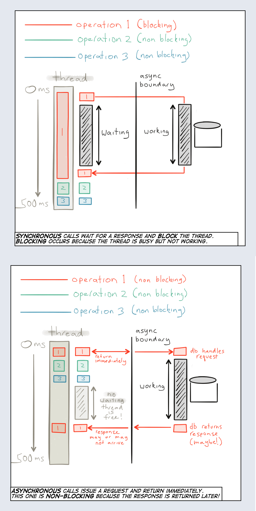
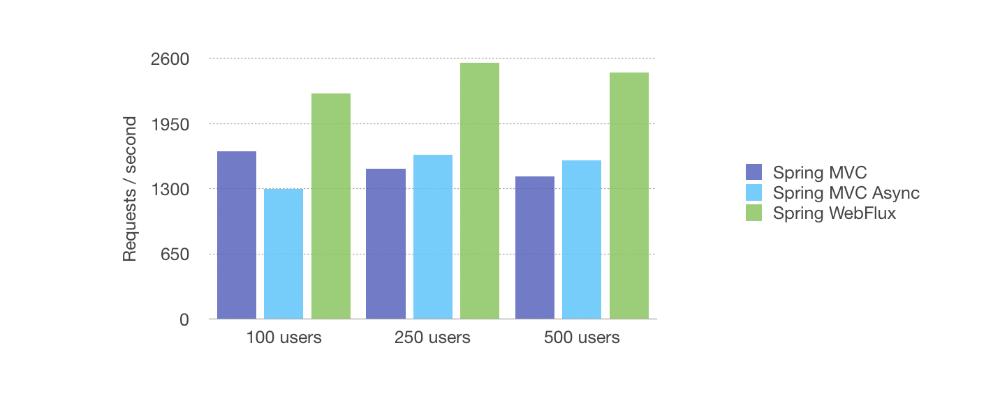

- [Programación reactiva](#programación-reactiva)
  - [Programación Secuencial vs Programación Reactiva](#programación-secuencial-vs-programación-reactiva)
  - [Project Reactor](#project-reactor)
  - [Cold Streams y Notificaciones en Tiempo Real](#cold-streams-y-notificaciones-en-tiempo-real)
  - [Bases de Datos con R2DBC](#bases-de-datos-con-r2dbc)


## Programación reactiva
La [programación reactiva](https://www.reactivemanifesto.org/es) es un paradigma de programación que se centra en el manejo de flujos de datos y la propagación de cambios. Esto significa que se puede establecer una variable que, cuando cambie, cause que otras variables o cálculos cambien automáticamente.

La [programación reactiva](https://joseluisgs.dev/blogs/2022/2022-12-06-ya-no-se-programar-sin-reactividad.html) se basa en el concepto de variables "observables" y "observadores". Un observable es una fuente de datos o eventos, y un observador es algo que está interesado en esos datos o eventos. Cuando un observable cambia, notifica a todos sus observadores.


Uno de los principales beneficios de la programación reactiva sobre la programación imperativa tradicional es que simplifica el manejo de eventos asincrónicos y múltiples flujos de datos. Es decir,  se refiere a la idea de que puedes tratar una colección de datos como un flujo de eventos. Por ejemplo, podrías tener una lista de pedidos en un sistema de comercio electrónico que se actualiza en tiempo real. En lugar de tener que comprobar constantemente si hay nuevos pedidos, puedes "observar" la lista y configurar tu código para que se ejecute automáticamente cada vez que se añade un nuevo pedido. O en aplicaciones con interfaces de usuario, donde los cambios en los datos a menudo necesitan reflejarse en la interfaz de usuario de forma inmediata. Por ejemplo, en una aplicación de chat, podrías observar la lista de mensajes y actualizar automáticamente la interfaz de usuario cada vez que se añade un nuevo mensaje.

Por último, la programación reactiva puede ayudar a mejorar el rendimiento de las aplicaciones al permitir un manejo más eficiente de los recursos. Por ejemplo, si estás observando una colección de datos que cambia con frecuencia, puedes configurar tu código para que sólo se ejecute cuando realmente se produzca un cambio, en lugar de tener que comprobar constantemente si los datos han cambiado.

Entre las muchas librerías tenemos RxJava, Webflux y Project Reactor, Flows, tec.

### Programación Secuencial vs Programación Reactiva
La programación secuencial y la programación reactiva son dos enfoques diferentes para manejar la concurrencia y la asincronía en el desarrollo de software. Aquí tienes una descripción de cada uno de ellos:

- Programación Secuencial: las operaciones se ejecutan en secuencia, una después de la otra, en un hilo de ejecución único. Las operaciones bloqueantes pueden detener la ejecución hasta que se complete una operación, lo que puede llevar a una espera innecesaria y un uso ineficiente de los recursos y que cada operación espera a que la anterior se complete antes de ejecutarse.

Programación Reactiva:se basa en el manejo de flujos de datos asincrónicos y eventos concurrentes diseñados para reaccionar a los cambios y eventos en tiempo real, en lugar de esperar pasivamente a que se complete una operación. Se basa en la propagación de eventos y la notificación de cambios, lo que permite un enfoque más eficiente y escalable para manejar flujos de datos en tiempo real. 

En resumen, la programación secuencial se basa en la ejecución secuencial de operaciones en un hilo único, mientras que la programación reactiva se centra en el manejo eficiente de flujos de datos asincrónicos y eventos concurrentes, utilizando patrones y operadores reactivos. La programación reactiva es especialmente útil en aplicaciones que requieren un alto rendimiento y capacidad de respuesta en tiempo real.

### Project Reactor
[Project Reactor](https://projectreactor.io/) es una biblioteca para la JVM que permite a los desarrolladores componer programas asincrónicos y basados en eventos utilizando secuencias de datos. Se basa en el paradigma de programación reactiva y es muy similar a RXJava (las diferencias a este nivel no las encontraás, pero el solo tener dos tipos de datos y el backpreasure más optimizado ayuda, y sobre todo su integración con algunos frameworks). Esto puede ser especialmente útil en aplicaciones con alta concurrencia o con flujos de datos en tiempo real.

Project Reactor ofrece dos tipos principales de secuencias de datos reactivas:

1. **Flux**: representa una secuencia de 0 a N elementos. En otras palabras, un Flux puede emitir múltiples elementos. Es similar a un Stream en Java, pero puede ser asincrónico y no bloqueante.

2. **Mono**: representa una secuencia de 0 a 1 elementos. Un Mono emitirá un elemento o ninguno, y luego completará. Es similar a un Future o a un Optional, pero también puede ser asincrónico y no bloqueante.

Estos dos tipos, Flux y Mono, implementan la interfaz `Publisher` del estándar Reactive Streams, lo que significa que pueden ser utilizados en cualquier lugar donde se espere un Publisher.

Project Reactor también proporciona una gran cantidad de operadores que puedes utilizar para transformar, combinar, filtrar, y de otra manera manipular estas secuencias de datos tal y como has hecho con los Streams (map, filter, etc)

Además, Project Reactor tiene soporte para la programación basada en backpressure, lo que significa que puede manejar situaciones en las que un productor de datos es más rápido que un consumidor de datos. En lugar de dejar que el consumidor se sobrecargue con datos, Project Reactor permite al consumidor indicar cuántos datos está listo para manejar en un momento dado.

```kotlin
dependencies {
    implementation("io.projectreactor:reactor-core:3.4.10") // Asegúrate de usar la última versión
}
```

```java
public class Main {
    public static void main(String[] args) {
        Mono<String> mono = Mono.just("Hello, World"); // Fuente de datos
        mono.subscribe(System.out::println); // Observador, cuando cambie actúo

        Flux<Integer> flux = Flux.just(1, 2, 3, 4, 5); // fuente de datos
        Flux<Integer> transformedFlux = flux.map(n -> n * 2); // transformo, puedo hacerlo en el original
        transformedFlux.subscribe(System.out::println); // Observador que actúa

        Flux<String> flux = Flux.just("1", "2", "oops", "4", "5")
            .map(i -> {
                try {
                    return Integer.parseInt(i);
                } catch (NumberFormatException e) {
                    throw new RuntimeException("Error al parsear el número", e);
                }
            })
            .onErrorReturn(-1);
        flux.subscribe(
            System.out::println,
            error -> System.err.println("Se ha producido un error: " + error)
        );
    }
}
``` 
Te dejo un ejmeplo de productor de datos y otro que lo consume
```java
public static void main(String[] args) throws InterruptedException {
    // Producimos valores constantes cada segundo... son infinitos
    Flux<Long> intervalFlux = Flux.interval(Duration.ofSeconds(1));

    // A veces no sabes cuando se producirán los datos, si no reaccionamos a ello.

    intervalFlux
            .filter(x -> x % 2 == 0)
            .map(x -> x * 10)
            .take(10) // toma al menos al menos x Valores (usa take) o hasta que se complete (usa blockLast)
            .subscribe(
                 // Se ejecuta cada vez que llega un valor
                    value -> System.out.println("Consumido: " + value),
                    // Se ejecuta cuando se produce un error
                    error -> System.err.println("Se ha producido un error: " + error),
                    // Se ejecuta cuando se completa el flujo (no es obligatorio) 
                    () -> System.out.println("Completado") /
            );

    // Mantén el hilo principal vivo durante un tiempo para que pueda consumir los valores
    // Thread.sleep(10000);
    intervalFlux.blockLast(); // como no termina nunca, bloqueamos el hilo principal
    // toma al menos al menos x Valores (usa take) o hasta que se complete (usa blockLast)
}
```

### Cold Streams y Notificaciones en Tiempo Real

Reuerda que Flujo de datos es un "Cold Stream", es decir, un "Flujo frío" es aquel que genera datos cuando un suscriptor comienza a observarlo. Esto significa que cada suscriptor recibe su propia secuencia de datos independiente. 

Pues gracias a esto, podemos hacernos servicios reactivos o leer datos suscribirnos a cambios en la base de datos, de manera que al hacer una modificación nos avise.

Simulemos esto con un array list de una clase DataBase, hay un metodos para escuchar y cada vez que haya un cambio consumimos el Flow.

Para ello haremos uso de `FluxSink` es una interfaz proporcionada por Reactor que permite la generación programática de eventos en un Flux. Se crea un `Flux<T>` usando el método `create`. Este método toma una función lambda que se invoca con un FluxSink. En este caso, la función simplemente almacena el FluxSink en la variable funkoFluxSink para su uso posterior. El método share se utiliza para hacer que este Flux sea "compartido", lo que significa que todos los suscriptores recibirán los mismos eventos.

Otra forma rápida de emitir es usando `Flux.create(sink -> {...})` e implementando el lambda asociado.

```java 
public class FunkoRepository {
    private final List<Funko> funkos = new ArrayList<>();

    // una interfaz proporcionada por Reactor que
    // permite la generación programática de eventos en un Flux.
    private FluxSink<List<Funko>> funkoFluxSink;

    // Usando el método create toma una función lambda que se invoca con un FluxSink.
    // En este caso, la función simplemente almacena el FluxSink
    // en la variable funkoFluxSink para su uso posterior.
    // El método share se utiliza para hacer que este Flux sea "compartido",
    // lo que significa que todos los suscriptores recibirán los mismos eventos.
    private final Flux<List<Funko>> funkoFlux = Flux.<List<Funko>>create(emitter -> this.funkoFluxSink = emitter).share();

    private FluxSink<String> funkoNotification;
    private final Flux<String> funkoNotificationFlux = Flux.<String>create(emitter -> this.funkoNotification = emitter).share();


    public void add(Funko funko) {
        funkos.add(funko);
        funkoFluxSink.next(funkos); // Emite el evento con la lista actualizada
        funkoNotification.next("Se ha añadido un nuevo Funko: " + funko); // Emite el evento con la notificacion
    }

    public void delete(UUID id) {
        Optional<Funko> funkoToRemove = funkos.stream().filter(f -> f.getId().equals(id)).findFirst();
        funkoToRemove.ifPresent(f -> {
            funkos.remove(f);
            funkoFluxSink.next(funkos); // Emite el evento con la lista actualizada
            funkoNotification.next("Se ha eliminado un Funko: " + f); // Emite el evento con la notificacion
        });
    }

    public Flux<List<Funko>> getAllAsFlux() {
        return funkoFlux;
    }

    public Flux<String> getNotificationAsFlux() {
        return funkoNotificationFlux;
    }
}

public class Main {
    public static void main(String[] args) throws InterruptedException {
        FunkoRepository repository = new FunkoRepository();

        System.out.println("Systema de obtención de la lista en Tiempo Real");
        repository.getAllAsFlux().subscribe(
                lista -> System.out.println("👉 Lista de Funkos actulizada: " + lista),
                error -> System.err.println("Se ha producido un error: " + error),
                () -> System.out.println("Completado")
        );

        System.out.println("Sistema de obtención de notificaciones en Tiempo Real");
        repository.getNotificationAsFlux().subscribe(
                notificacion -> System.out.println("🟢 Notificación: " + notificacion),
                error -> System.err.println("Se ha producido un error: " + error),
                () -> System.out.println("Completado")
        );

        Funko funko1 = new Funko(UUID.randomUUID(), "Funko1", 10.0);
        System.out.println("Añadimos un nuevo Funko: " + funko1);
        repository.add(funko1);
        Thread.sleep(5000);

        Funko funko2 = new Funko(UUID.randomUUID(), "Funko2", 20.0);
        System.out.println("Añadimos un nuevo Funko: " + funko2);
        repository.add(funko2);
        Thread.sleep(5000);

        System.out.println("Eliminamos un Funko: " + funko1);
        repository.delete(funko1.getId());
        Thread.sleep(5000);

        Funko funko3 = new Funko(UUID.randomUUID(), "Funko3", 30.0);
        System.out.println("Añadimos un nuevo Funko: " + funko3);
        repository.add(funko3);
        Thread.sleep(5000);

        System.out.println("Eliminamos un Funko: " + funko2);
        repository.delete(funko2.getId());
        Thread.sleep(5000);
    }
}

```

Obtendremos de salida
```
Systema de obtención de la lista en Tiempo Real
Sistema de obtención de notificaciones en Tiempo Real
Añadimos un nuevo Funko: Funko(id=f8bbcd96-62bb-45eb-b241-998f6dedec6b, name=Funko1, price=10.0)
👉 Lista de Funkos actulizada: [Funko(id=f8bbcd96-62bb-45eb-b241-998f6dedec6b, name=Funko1, price=10.0)]
🟢 Notificación: Se ha añadido un nuevo Funko: Funko(id=f8bbcd96-62bb-45eb-b241-998f6dedec6b, name=Funko1, price=10.0)
Añadimos un nuevo Funko: Funko(id=d67af3ee-f1da-4543-97ea-ed93a1066cb6, name=Funko2, price=20.0)
👉 Lista de Funkos actulizada: [Funko(id=f8bbcd96-62bb-45eb-b241-998f6dedec6b, name=Funko1, price=10.0), Funko(id=d67af3ee-f1da-4543-97ea-ed93a1066cb6, name=Funko2, price=20.0)]
🟢 Notificación: Se ha añadido un nuevo Funko: Funko(id=d67af3ee-f1da-4543-97ea-ed93a1066cb6, name=Funko2, price=20.0)
Eliminamos un Funko: Funko(id=f8bbcd96-62bb-45eb-b241-998f6dedec6b, name=Funko1, price=10.0)
👉 Lista de Funkos actulizada: [Funko(id=d67af3ee-f1da-4543-97ea-ed93a1066cb6, name=Funko2, price=20.0)]
🟢 Notificación: Se ha eliminado un Funko: Funko(id=f8bbcd96-62bb-45eb-b241-998f6dedec6b, name=Funko1, price=10.0)
Añadimos un nuevo Funko: Funko(id=0729a565-25d2-4f02-bc30-c503eed2ccad, name=Funko3, price=30.0)
👉 Lista de Funkos actulizada: [Funko(id=d67af3ee-f1da-4543-97ea-ed93a1066cb6, name=Funko2, price=20.0), Funko(id=0729a565-25d2-4f02-bc30-c503eed2ccad, name=Funko3, price=30.0)]
🟢 Notificación: Se ha añadido un nuevo Funko: Funko(id=0729a565-25d2-4f02-bc30-c503eed2ccad, name=Funko3, price=30.0)
Eliminamos un Funko: Funko(id=d67af3ee-f1da-4543-97ea-ed93a1066cb6, name=Funko2, price=20.0)
👉 Lista de Funkos actulizada: [Funko(id=0729a565-25d2-4f02-bc30-c503eed2ccad, name=Funko3, price=30.0)]
🟢 Notificación: Se ha eliminado un Funko: Funko(id=d67af3ee-f1da-4543-97ea-ed93a1066cb6, name=Funko2, price=20.0)
```


### Bases de Datos con R2DBC
Trabajar reactivamente con bases de datos o servicios, implica que no vamos a bloquear hasta que se resuleva, si no que reaccionaremos cuando se obtenga el resultado. Esto nos ofrece poder reutilizar mejor nuestros recursos. 





Con bases de datos usaremos [R2DBC](https://r2dbc.io/) que nos ofece un driver reactivo para desarrollar [nuestras apps sobre JVM](https://www.baeldung.com/r2dbc). 

```kotlin
dependencies {
    implementation("io.r2dbc:r2dbc-h2:0.8.4.RELEASE")
    implementation("io.r2dbc:r2dbc-pool:0.8.5.RELEASE")
    implementation("org.projectreactor:reactor-core:3.4.8")
}
```

```java
public class DatabaseManager {

    private static DatabaseManager instance;

    private final ConnectionFactory connectionFactory;

    private DatabaseManager(String propertiesFilePath) {
        Properties properties = new Properties();
        try (InputStream input = getClass().getClassLoader().getResourceAsStream(propertiesFilePath)) {
            if (input == null) {
                throw new IOException("Imposible localizar " + propertiesFilePath);
            }
            properties.load(input);
        } catch (IOException ex) {
            throw new RuntimeException("Fallo al leer el fichero de propiedades desde " + propertiesFilePath, ex);
        }

        String url = properties.getProperty("database.url");
        String username = properties.getProperty("database.username");
        String password = properties.getProperty("database.password");

        H2ConnectionConfiguration configuration = H2ConnectionConfiguration.builder()
                .url(url)
                .username(username)
                .password(password)
                .build();
        this.connectionFactory = new H2ConnectionFactory(configuration);
    }

    public static synchronized DatabaseManager getInstance(String propertiesFilePath) {
        if (instance == null) {
            instance = new DatabaseManager(propertiesFilePath);
        }
        return instance;
    }

    public ConnectionFactory getConnectionFactory() {
        return this.connectionFactory;
    }
}

public class FunkoRepository {

    private final ConnectionFactory connectionFactory;

    public FunkoRepository(DatabaseManager databaseManager) {
        this.connectionFactory = databaseManager.getConnectionFactory();
    }

    public Flux<Funko> getAllFunkos() {
        String sql = "SELECT * FROM funkos";
        return Flux.usingWhen(
                connectionFactory.create(),
                connection -> Flux.from(connection.createStatement(sql).execute())
                        .flatMap(result -> result.map((row, rowMetadata) -> new Funko(
                                UUID.fromString(row.get("id", String.class)),
                                row.get("name", String.class),
                                row.get("price", Double.class)
                        ))),
                Connection::close
        );
    }

    public Mono<Funko> getFunkoById(UUID id) {
        String sql = "SELECT * FROM funkos WHERE id = $1";
        return Mono.usingWhen(
                connectionFactory.create(),
                connection -> Mono.from(connection.createStatement(sql)
                        .bind("$1", id.toString())
                        .execute())
                        .flatMap(result -> Mono.from(result.map((row, rowMetadata) -> new Funko(
                                UUID.fromString(row.get("id", String.class)),
                                row.get("name", String.class),
                                row.get("price", Double.class)
                        )))),
                Connection::close
        );
    }

    public Mono<Void> insertFunko(Funko funko) {
        String sql = "INSERT INTO funkos (id, name, price) VALUES ($1, $2, $3)";
        return Mono.usingWhen(
                connectionFactory.create(),
                connection -> connection.createStatement(sql)
                        .bind("$1", funko.getId().toString())
                        .bind("$2", funko.getName())
                        .bind("$3", funko.getPrice())
                        .execute()
                        .then(),
                Connection::close
        );
    }

    public Mono<Void> updateFunko(Funko funko) {
        String sql = "UPDATE funkos SET name = $2, price = $3 WHERE id = $1";
        return Mono.usingWhen(
                connectionFactory.create(),
                connection -> connection.createStatement(sql)
                        .bind("$1", funko.getId().toString())
                        .bind("$2", funko.getName())
                        .bind("$3", funko.getPrice())
                        .execute()
                        .then(),
                Connection::close
        );
    }

    public Mono<Void> deleteFunko(UUID id) {
        String sql = "DELETE FROM funkos WHERE id = $1";
        return Mono.usingWhen(
                connectionFactory.create(),
                connection -> connection.createStatement(sql)
                        .bind("$1", id.toString())
                        .execute()
                        .then(),
                Connection::close
        );
    }
}
```