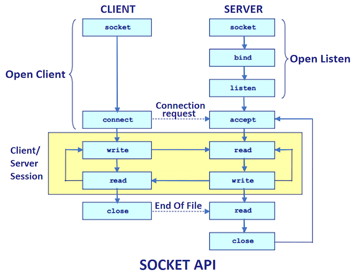

- [Programación distribuida con sockets](#programación-distribuida-con-sockets)
  - [Sockets](#sockets)
  - [Ejemplo](#ejemplo)

## Programación distribuida con sockets
### Sockets
La programación de sockets en Java permite la comunicación entre aplicaciones a través de la red utilizando el protocolo TCP/IP. Los elementos principales en la programación de sockets en Java son:

1. Socket: Es una clase que representa un punto final de una conexión de red. Un socket se puede utilizar tanto para enviar como para recibir datos.

2. ServerSocket: Es una clase que se utiliza para crear un servidor que escucha conexiones entrantes de clientes. El servidor espera en un puerto específico y cuando se establece una conexión, se crea un objeto Socket para manejar la comunicación con el cliente.

3. InputStream y OutputStream: Son clases utilizadas para leer y escribir datos a través de un socket. El InputStream se utiliza para recibir datos del socket, mientras que el OutputStream se utiliza para enviar datos al socket.

A continuación, te mostraré un ejemplo de un cliente y un servidor multihilo en Java. Debo recordarte la importancia de sincronizar el diálogo. En este ejemplo, el servidor crea un hilo para manejar la comunicación con cada cliente. De esta manera, el servidor puede manejar múltiples clientes simultáneamente.



### Ejemplo

Servidor:
```java
import java.io.BufferedReader;
import java.io.IOException;
import java.io.InputStreamReader;
import java.io.PrintWriter;
import java.net.ServerSocket;
import java.net.Socket;

public class Server {
    public static void main(String[] args) {
        try {
            ServerSocket serverSocket = new ServerSocket(12345);
            System.out.println("Servidor iniciado. Esperando conexiones...");

            while (true) {
                Socket clientSocket = serverSocket.accept();
                System.out.println("Cliente conectado: " + clientSocket.getInetAddress().getHostAddress());

                ClientHandler clientHandler = new ClientHandler(clientSocket);
                Thread thread = new Thread(clientHandler);
                thread.start();
            }
        } catch (IOException e) {
            e.printStackTrace();
        }
    }

    static class ClientHandler implements Runnable {
        private Socket clientSocket;

        public ClientHandler(Socket clientSocket) {
            this.clientSocket = clientSocket;
        }

        @Override
        public void run() {
            try {
                BufferedReader reader = new BufferedReader(new InputStreamReader(clientSocket.getInputStream()));
                PrintWriter writer = new PrintWriter(clientSocket.getOutputStream(), true);

                String message;
                while ((message = reader.readLine()) != "salir") {
                    System.out.println("Mensaje recibido: " + message);

                    String response = "Respuesta del servidor: " + message.toUpperCase();
                    writer.println(response);
                }
                
                writer.println("Respuesta del servidor: Adios!");

                writer.close();
                reader.close();
                clientSocket.close();
            } catch (IOException e) {
                e.printStackTrace();
            }
        }
    }
}
```

Cliente:
```java
import java.io.BufferedReader;
import java.io.IOException;
import java.io.InputStreamReader;
import java.io.PrintWriter;
import java.net.Socket;

public class Client {
    public static void main(String[] args) {
        try {
            Socket socket = new Socket("localhost", 12345);
            System.out.println("Conexión establecida con el servidor.");

            BufferedReader reader = new BufferedReader(new InputStreamReader(socket.getInputStream()));
            PrintWriter writer = new PrintWriter(socket.getOutputStream(), true);

            String message = "Hola, servidor!";
            writer.println(message);

            String response = reader.readLine();
            System.out.println("Respuesta del servidor: " + response);

            message = "¿Que tal estás?"
            writer.println(message);

            response = reader.readLine();
            System.out.println("Respuesta del servidor: " + response);

            message = "salir";
            writer.println(message);

            response = reader.readLine();
            System.out.println("Respuesta del servidor: " + response);

            reader.close();
            writer.close();
            socket.close();
        } catch (IOException e) {
            e.printStackTrace();
        }
    }
}
```

En este ejemplo, el servidor recibe los mensajes del cliente utilizando un `BufferedReader` para leer líneas de texto. Luego, transforma el mensaje a mayúsculas y lo envía de vuelta al cliente utilizando un `PrintWriter`. El cliente, por su parte, envía un mensaje al servidor utilizando un `PrintWriter` y recibe la respuesta del servidor utilizando un `BufferedReader`.

Es importante tener en cuenta que los mensajes enviados y recibidos son líneas de texto completas, ya que se utiliza el método `readLine()` para leer y escribir en el socket.