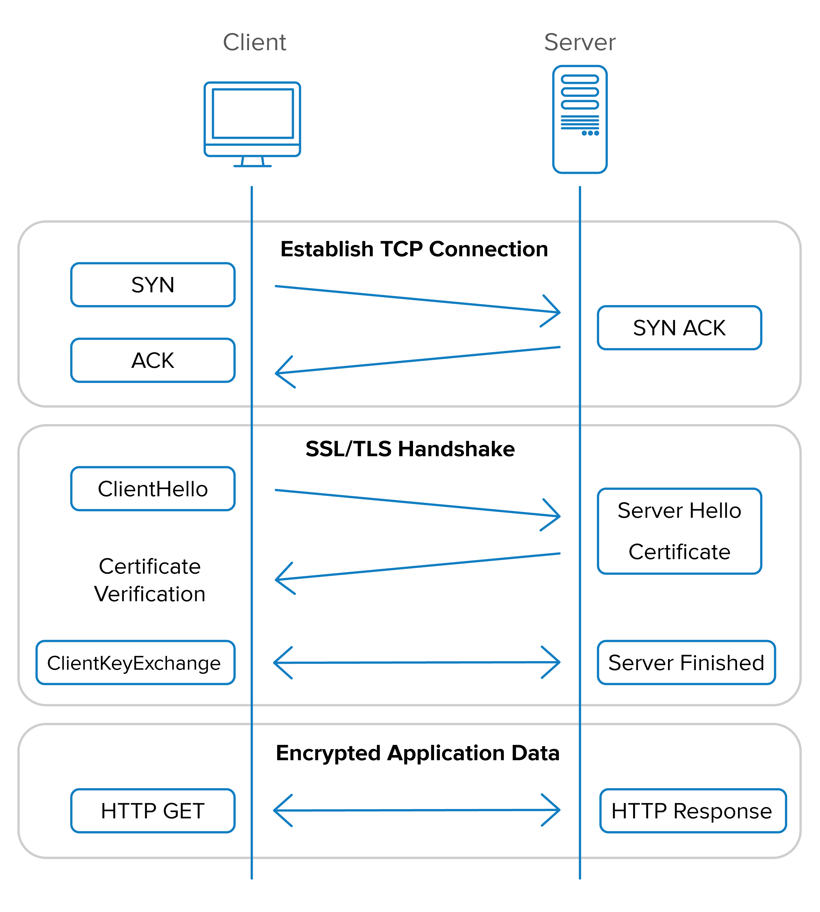

- [Seguridad en aplicaciones de servidor](#seguridad-en-aplicaciones-de-servidor)
  - [Autenticación y Autorización](#autenticación-y-autorización)
    - [JWT](#jwt)
- [SSL/TSL](#ssltsl)
  - [Handshake](#handshake)
  - [Generación de Certificados](#generación-de-certificados)
    - [Ejemplo](#ejemplo)

## Seguridad en aplicaciones de servidor

### Autenticación y Autorización
La autenticación y la autorización son dos aspectos fundamentales en las aplicaciones en red. A continuación, te explico la importancia de cada uno de ellos:

1. Autenticación:
La autenticación se refiere al proceso de verificar la identidad de un usuario o entidad que intenta acceder a un sistema. Es esencial para garantizar que solo los usuarios legítimos tengan acceso a los recursos y funcionalidades de una aplicación. Al autenticar a los usuarios, se asegura que sean quienes dicen ser, generalmente mediante la verificación de credenciales, como un nombre de usuario y una contraseña. La autenticación es crucial para prevenir el acceso no autorizado y proteger la información sensible.

2. Autorización:
La autorización se ocupa de determinar qué acciones o recursos están permitidos para un usuario autenticado en una aplicación. Después de que un usuario se autentica, la autorización establece los permisos y los niveles de acceso que se le otorgan. Esto se logra mediante la asignación de roles, privilegios o permisos específicos a los usuarios. La autorización garantiza que los usuarios solo puedan acceder a los recursos y realizar acciones para los que tienen permiso, evitando así posibles abusos o violaciones de seguridad.

La importancia de la sesión en la autenticación y autorización radica en mantener el estado y la continuidad de la identidad del usuario durante su interacción con la aplicación. Una sesión representa la conexión entre el usuario y la aplicación, y permite mantener información relevante y contextual sobre el usuario autenticado. Algunos aspectos clave son:

- Gestión de sesiones: La aplicación debe establecer y gestionar correctamente las sesiones para cada usuario autenticado. Esto implica asignar un identificador único a cada sesión y mantener un registro de las sesiones activas.

- Almacenamiento de información de sesión: Durante una sesión, se pueden almacenar datos relevantes, como la identificación del usuario, los roles asignados, las preferencias o cualquier otra información necesaria para personalizar la experiencia del usuario o aplicar reglas de autorización.

- Control de acceso basado en sesiones: La información de sesión se utiliza para verificar la autorización de cada solicitud o acción realizada por el usuario. Se pueden aplicar controles de acceso a nivel de sesión para garantizar que el usuario tenga los permisos adecuados para llevar a cabo una determinada acción.

- Caducidad y cierre de sesiones: Es importante establecer políticas de caducidad de sesiones para proteger la seguridad de la aplicación. Las sesiones deben cerrarse automáticamente después de un período de inactividad o cuando el usuario cierra explícitamente la sesión.

En resumen, la autenticación y la autorización son fundamentales para garantizar la seguridad y el control de acceso en las aplicaciones en red. La sesión desempeña un papel crucial en la gestión de la identidad del usuario y en la aplicación de políticas de autorización, permitiendo una interacción segura y personalizada entre el usuario y la aplicación.

#### JWT

[JWT](https://jwt.io/) (JSON Web Tokens) es un estándar abierto (RFC 7519) que define un formato compacto y seguro para transmitir información entre partes como un objeto JSON. Se utiliza comúnmente en aplicaciones web y móviles para la autenticación y autorización de usuarios. JWT es una forma eficiente de transmitir información de manera segura y confiable, ya que los tokens están firmados digitalmente.

Aquí está cómo se relacionan los conceptos de autenticación, autorización y JWT:

1. Autenticación:
JWT se utiliza para autenticar a los usuarios mediante la generación de un token JWT firmado digitalmente. Cuando un usuario se autentica en una aplicación, se genera un JWT que contiene información sobre la identidad del usuario, como su ID de usuario o su nombre de usuario. Este token se devuelve al cliente y se almacena en el lado del cliente (por ejemplo, en las cookies o en el almacenamiento local del navegador) para su uso posterior en las solicitudes posteriores.

2. Autorización:
Una vez que un usuario se ha autenticado y posee un JWT válido, la aplicación puede utilizar la información contenida en el token para autorizar las solicitudes del usuario. El JWT puede contener información adicional, como los roles o permisos del usuario. La aplicación puede verificar y decodificar el JWT para obtener esta información y tomar decisiones sobre qué recursos o funcionalidades se le permiten al usuario acceder.

Implementación de JWT:

La implementación de JWT generalmente implica los siguientes pasos


1. Generación del token:
Después de que un usuario se autentica correctamente, se genera un JWT utilizando una biblioteca JWT. El token se compone de tres partes separadas por puntos: el encabezado, el cuerpo y la firma. El encabezado contiene información sobre el algoritmo de firma utilizado, como HMAC o RSA. El cuerpo contiene los datos del usuario, como su ID o roles. La firma se genera utilizando una clave secreta conocida solo por el servidor.

2. Envío y almacenamiento del token:
El token JWT se envía al cliente (generalmente en la respuesta del servidor) y se almacena en el lado del cliente (por ejemplo, en las cookies o en el almacenamiento local del navegador). El cliente debe incluir el token en cada solicitud subsiguiente para demostrar su autenticidad y autorización.

3. Validación del token:
Cuando el cliente realiza una solicitud al servidor, el servidor debe validar el token JWT enviado por el cliente. Esto implica verificar la firma del token utilizando la clave secreta conocida solo por el servidor. Además, se comprueba si el token ha expirado y si los datos contenidos en el token son válidos y confiables.

4. Autorización basada en el token:
Una vez que el servidor ha validado el token JWT, puede utilizar la información contenida en el token para autorizar las solicitudes del cliente. Esto puede implicar verificar los roles o permisos del usuario y permitir o denegar el acceso a los recursos o funcionalidades correspondientes.

JWT proporciona una forma segura y eficiente de autenticar y autorizar usuarios en aplicaciones en red. Al utilizar tokens firmados digitalmente, se garantiza la integridad y la autenticidad de la información transmitida. Además, JWT permite una implementación sin estado, lo que significa que el servidor no necesita almacenar información sobre los usuarios autenticados, lo que simplifica la escalabilidad y el rendimiento de la aplicación.


## SSL/TSL
SSL (Secure Sockets Layer) y TLS (Transport Layer Security) son protocolos de seguridad que proporcionan cifrado y autenticación para las comunicaciones en línea. Ambos protocolos son fundamentales para garantizar la privacidad y la integridad de los datos transmitidos a través de redes como Internet. A continuación, te explico la importancia de SSL/TLS en las comunicaciones:

1. Cifrado de datos: SSL/TLS utiliza algoritmos de cifrado para proteger los datos transmitidos entre un cliente y un servidor. Esto significa que los datos se convierten en un formato ilegible para terceros no autorizados, lo que garantiza la confidencialidad de la información sensible, como contraseñas, datos personales o información financiera.

2. Autenticación del servidor: SSL/TLS permite verificar la identidad del servidor al que un cliente se conecta. Esto se logra mediante certificados digitales emitidos por autoridades de certificación confiables. La autenticación del servidor ayuda a prevenir ataques de intermediarios, donde un tercero intenta suplantar al servidor y obtener información confidencial.

3. Integridad de los datos: SSL/TLS utiliza funciones de resumen (hashing) y firmas digitales para garantizar la integridad de los datos transmitidos. Esto significa que cualquier modificación o alteración de los datos durante la transmisión será detectada, ya que la firma digital no coincidirá con los datos recibidos.

4. Confianza y seguridad: Al implementar SSL/TLS, se establece una capa adicional de confianza y seguridad en las comunicaciones en línea. Los usuarios pueden tener la tranquilidad de que sus datos están protegidos y que están interactuando con el sitio o servicio legítimo.

### Handshake
El handshake (apretón de manos) es un proceso fundamental en el establecimiento de una conexión segura utilizando los protocolos SSL/TLS. Durante el handshake, el cliente y el servidor intercambian información y acuerdan los parámetros de cifrado y autenticación necesarios para establecer una conexión segura. A continuación, te explico los pasos principales del handshake:



1. Cliente envía solicitud de conexión: El cliente envía una solicitud de conexión al servidor indicando su intención de establecer una conexión segura utilizando SSL/TLS.

2. Servidor responde con certificado: El servidor responde enviando su certificado digital, que contiene su clave pública y otros detalles relevantes. El certificado está firmado por una autoridad de certificación confiable.

3. Cliente verifica el certificado: El cliente verifica la autenticidad del certificado del servidor. Esto implica comprobar la validez del certificado, la cadena de confianza y la firma digital. Si el certificado no es válido o no se puede verificar, el cliente puede abortar la conexión.

4. Cliente genera clave de sesión: El cliente genera una clave de sesión aleatoria que se utilizará para cifrar los datos durante la conexión. La clave de sesión se cifra con la clave pública del servidor y se envía al servidor.

5. Servidor desencripta la clave de sesión: El servidor utiliza su clave privada para desencriptar la clave de sesión enviada por el cliente y la recupera.

6. Cliente y servidor acuerdan parámetros de cifrado: El cliente y el servidor acuerdan los parámetros de cifrado y autenticación que se utilizarán durante la conexión. Esto incluye el algoritmo de cifrado, el modo de operación, la longitud de la clave y otros detalles.

7. Cliente y servidor intercambian mensajes cifrados: A partir de este punto, el cliente y el servidor utilizan la clave de sesión compartida para cifrar y descifrar los mensajes que se envían durante la conexión.

Una vez completado el handshake, la conexión se considera segura y tanto el cliente como el servidor pueden comenzar a intercambiar datos de manera cifrada. El handshake se realiza solo al establecer la conexión inicial y no se repite durante la comunicación.

### Generación de Certificados
Para generar un certificado en Windows que pueda ser utilizado en Java, puedes seguir los siguientes pasos:

1. Abre la consola de comandos de Windows (cmd).

2. Navega hasta el directorio donde deseas generar el certificado.

3. Ejecuta el siguiente comando para generar un archivo de clave privada (.key) y una solicitud de firma de certificado (.csr):

   ```shell
   keytool -genkeypair -alias myalias -keyalg RSA -keysize 2048 -keystore keystore.jks
   ```

   Reemplaza `myalias` con el nombre que desees para el alias del certificado y `keystore.jks` con el nombre que desees para el archivo de almacén de claves.

4. A continuación, se te pedirá que ingreses una contraseña para el almacén de claves y también para la clave privada del certificado. Ingresa y confirma las contraseñas.

5. Luego, se te solicitará información sobre el propietario del certificado, como el nombre, la organización, la unidad organizativa, el país, etc. Proporciona la información requerida y presiona Enter.

6. Una vez completados los pasos anteriores, se generará el archivo de almacén de claves (`keystore.jks`) en el directorio actual.

7. Ahora, para exportar el certificado del almacén de claves en formato X.509 (.cer), ejecuta el siguiente comando:

   ```shell
   keytool -exportcert -alias myalias -keystore keystore.jks -file certificate.cer
   ```

   Reemplaza `myalias` con el nombre del alias que hayas utilizado anteriormente y `certificate.cer` con el nombre que desees para el archivo de certificado exportado.

8. Ahora tienes el certificado exportado en formato X.509 (`certificate.cer`) que puedes utilizar en tu aplicación Java.

Recuerda que el archivo de almacén de claves (`keystore.jks`) contiene tanto el certificado como la clave privada y debe mantenerse seguro.

#### Ejemplo
Aquí tienes un ejemplo básico de un programa cliente-servidor en Java que intercambia datos utilizando SSL/TLS con un certificado ubicado en la carpeta "cert":

Servidor:
```java
import javax.net.ssl.*;
import java.io.*;

public class SSLServer {
    public static void main(String[] args) {
        int port = 12345;
        String keystorePath = "cert/keystore.jks";
        String keystorePassword = "password";

        try {
            // Configurar el SSLContext
            SSLContext sslContext = SSLContext.getInstance("TLS");
            KeyManagerFactory keyManagerFactory = KeyManagerFactory.getInstance("SunX509");
            KeyStore keyStore = KeyStore.getInstance("JKS");

            // Cargar el certificado del almacén de claves
            FileInputStream fis = new FileInputStream(keystorePath);
            keyStore.load(fis, keystorePassword.toCharArray());
            fis.close();

            keyManagerFactory.init(keyStore, keystorePassword.toCharArray());
            sslContext.init(keyManagerFactory.getKeyManagers(), null, null);

            // Crear el servidor SSL
            SSLServerSocketFactory sslServerSocketFactory = sslContext.getServerSocketFactory();
            SSLServerSocket sslServerSocket = (SSLServerSocket) sslServerSocketFactory.createServerSocket(port);

            System.out.println("Servidor iniciado. Esperando conexiones...");

            // Esperar por conexiones entrantes
            SSLSocket sslSocket = (SSLSocket) sslServerSocket.accept();

            // Leer datos del cliente
            BufferedReader reader = new BufferedReader(new InputStreamReader(sslSocket.getInputStream()));
            String message = reader.readLine();
            System.out.println("Mensaje recibido del cliente: " + message);

            // Enviar respuesta al cliente
            PrintWriter writer = new PrintWriter(sslSocket.getOutputStream(), true);
            writer.println("Respuesta del servidor: ¡Hola cliente!");

            // Cerrar conexiones
            writer.close();
            reader.close();
            sslSocket.close();
            sslServerSocket.close();
        } catch (Exception e) {
            e.printStackTrace();
        }
    }
}
```

Cliente:
```java
import javax.net.ssl.*;
import java.io.*;

public class SSLClient {
    public static void main(String[] args) {
        String serverHost = "localhost";
        int serverPort = 12345;
        String truststorePath = "cert/truststore.jks";
        String truststorePassword = "password";

        try {
            // Configurar el SSLContext
            SSLContext sslContext = SSLContext.getInstance("TLS");
            TrustManagerFactory trustManagerFactory = TrustManagerFactory.getInstance("SunX509");
            KeyStore trustStore = KeyStore.getInstance("JKS");

            // Cargar el certificado del almacén de confianza
            FileInputStream fis = new FileInputStream(truststorePath);
            trustStore.load(fis, truststorePassword.toCharArray());
            fis.close();

            trustManagerFactory.init(trustStore);
            sslContext.init(null, trustManagerFactory.getTrustManagers(), null);

            // Crear el socket SSL
            SSLSocketFactory sslSocketFactory = sslContext.getSocketFactory();
            SSLSocket sslSocket = (SSLSocket) sslSocketFactory.createSocket(serverHost, serverPort);

            // Enviar datos al servidor
            PrintWriter writer = new PrintWriter(sslSocket.getOutputStream(), true);
            writer.println("¡Hola servidor!");

            // Leer respuesta del servidor
            BufferedReader reader = new BufferedReader(new InputStreamReader(sslSocket.getInputStream()));
            String response = reader.readLine();
            System.out.println("Respuesta del servidor: " + response);

            // Cerrar conexiones
            writer.close();
            reader.close();
            sslSocket.close();
        } catch (Exception e) {
            e.printStackTrace();
        }
    }
}
```

Asegúrate de reemplazar los valores de `keystorePath`, `keystorePassword`, `truststorePath` y `truststorePassword` con la ubicación y contraseña correctas de tus archivos de certificado.