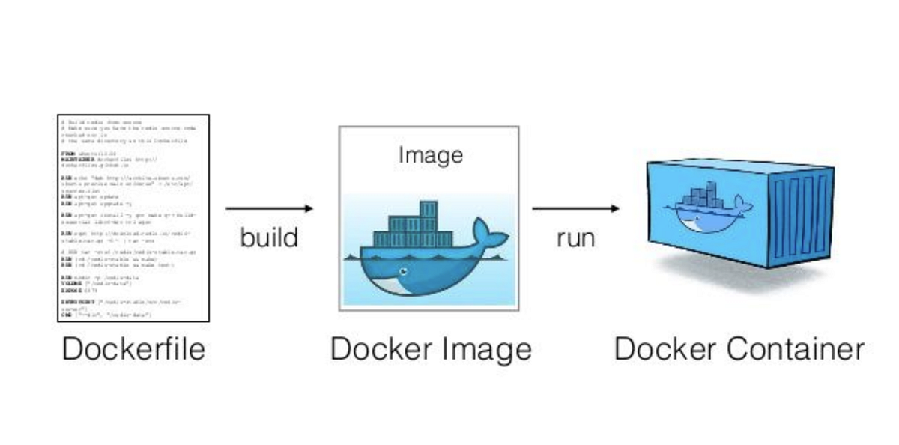

- [Dockerización de aplicaciones de servidor](#dockerización-de-aplicaciones-de-servidor)
  - [Tutorial](#tutorial)
  - [Docker](#docker)
  - [Docker Compose](#docker-compose)
  - [Despliegue de aplicación JVM](#despliegue-de-aplicación-jvm)
  - [Compilando y Desplegar usando Docker](#compilando-y-desplegar-usando-docker)

## Dockerización de aplicaciones de servidor

### Tutorial
Nos vamos a basar en este tutorial, con distintos ejemplos.
- [Tutorial de Docker](https://github.com/joseluisgs/docker-tutorial)

No olvides tener esto en la cabeza


### Docker
[Docker](https://www.docker.com/) es una plataforma de código abierto que permite automatizar el despliegue de aplicaciones dentro de contenedores, lo que facilita la creación, distribución y ejecución de aplicaciones en entornos aislados. Un contenedor es una unidad de software ligera y portátil que contiene todo lo necesario para ejecutar una aplicación, incluyendo el código, las dependencias y las configuraciones.

En Docker, una imagen es una plantilla de solo lectura que contiene el sistema operativo, las bibliotecas y las dependencias necesarias para ejecutar una aplicación. Un contenedor se crea a partir de una imagen y se ejecuta como una instancia aislada de la aplicación.



A continuación, te mostraré un ejemplo de Dockerfile para crear una imagen de MariaDB:

```Dockerfile
FROM mariadb:latest

ENV MYSQL_ROOT_PASSWORD=mysecretpassword
ENV MYSQL_DATABASE=mydatabase

COPY ./my-custom-config.cnf /etc/mysql/conf.d/
```

Y un ejemplo de como iniciarla
  
```bash
docker run --name some-mariadb -e MYSQL_ROOT_PASSWORD=mysecretpassword -d mariadb:tag
```

En este ejemplo, se utiliza la imagen base `mariadb:latest` que está disponible en Docker Hub. Se establecen variables de entorno para configurar la contraseña de root y el nombre de la base de datos. Luego, se copia un archivo de configuración personalizado (`my-custom-config.cnf`) al directorio de configuración de MariaDB.


### Docker Compose

Docker Compose es una herramienta que simplifica la administración de aplicaciones multi-contenedor en Docker. Permite definir la configuración de los servicios, redes y volúmenes en un archivo YAML y proporciona comandos para crear y administrar los contenedores de manera eficiente. Con Docker Compose, puedes iniciar, detener y gestionar fácilmente todos los contenedores de tu aplicación con un solo comando.

Docker Compose es especialmente útil cuando tienes una aplicación que depende de múltiples servicios, como una aplicación web que utiliza un servidor de base de datos y un servidor web. Con Compose, puedes definir y administrar fácilmente todos estos servicios como un conjunto coherente.

A continuación, te mostraré un ejemplo de Docker Compose para crear un entorno de PHP, MariaDB y PHPMyAdmin:

```yaml
version: '3.8'
services:
  php:
    build:
      context: .
      dockerfile: Dockerfile.php
    ports:
      - 80:80
    volumes:
      - ./app:/var/www/html

  mariadb:
    image: mariadb:latest
    environment:
      MYSQL_ROOT_PASSWORD: mysecretpassword
      MYSQL_DATABASE: mydatabase

  phpmyadmin:
    image: phpmyadmin/phpmyadmin:latest
    ports:
      - 8080:80
    environment:
      PMA_HOST: mariadb
      MYSQL_ROOT_PASSWORD: mysecretpassword
```

En este ejemplo de Docker Compose, se definen tres servicios: `php`, `mariadb` y `phpmyadmin`. El servicio `php` se construye a partir de un Dockerfile llamado `Dockerfile.php` en el contexto actual y se mapea el puerto 80 del contenedor al puerto 80 del host. Además, se monta el directorio `./app` en el contenedor para que los archivos de la aplicación estén disponibles.

El servicio `mariadb` utiliza la imagen `mariadb:latest` y se configuran las variables de entorno para establecer la contraseña de root y el nombre de la base de datos.

El servicio `phpmyadmin` utiliza la imagen `phpmyadmin/phpmyadmin:latest` y se mapea el puerto 8080 del contenedor al puerto 80 del host. Se establecen las variables de entorno para indicar que se conecte al servicio `mariadb` y se configure la contraseña de root.

Al ejecutar `docker-compose up`, se creará y ejecutará un entorno con PHP, MariaDB y PHPMyAdmin, todos conectados entre sí. Esto permitirá desarrollar y probar aplicaciones PHP con una base de datos MariaDB y administrarla a través de PHPMyAdmin.

### Despliegue de aplicación JVM
Para desplegar una aplicación Java en un contenedor Docker, necesitarás un Dockerfile que defina cómo se va a construir tu contenedor y tu fichero jar.

```Dockerfile
# Usa una imagen base de Java 11 (puedes cambiar a la versión que necesites)
FROM openjdk:11-jdk

# Copia el archivo .jar de tu aplicación al contenedor, cuidado donde esta por ejemplo si 
# esta en un directorio target, lo copiará al directorio raíz del contenedor (Gradle o Maven)
COPY target/mi-aplicacion.jar mi-aplicacion.jar

# Define el comando para ejecutar tu aplicación
ENTRYPOINT ["java","-jar","/mi-aplicacion.jar"]
```

Este Dockerfile asume que tienes un archivo .jar llamado `mi-aplicacion.jar` en el directorio `target` de tu proyecto.

Para construir la imagen de Docker a partir de este Dockerfile, puedes usar el siguiente comando:

```bash
docker build -t mi-aplicacion .
```

Y para ejecutar el contenedor, puedes usar el siguiente comando, si por ejemplo usa un puerto:

```bash
docker run -p 8080:8080 mi-aplicacion
```

Este comando ejecutará tu aplicación y mapeará el puerto 8080 del contenedor al puerto 8080 de tu máquina local.

### Compilando y Desplegar usando Docker
Para compilar y construir el archivo .jar dentro del contenedor Docker, puedes usar un enfoque de múltiples etapas en tu Dockerfile. Aquí hay un ejemplo de cómo hacerlo:

```Dockerfile
# Etapa de compilación su usas gradle cambia, esta etapa se llama build
FROM maven:3.8.1-openjdk-11-slim AS build

# Directorio de trabajo
WORKDIR /workspace/app

# Copia los archivos pom.xml y src. Cammbia al metodo con gadle
COPY mvnw .
COPY .mvn .mvn
COPY pom.xml .
COPY src src

# Compila y construye el proyecto, evita los test
RUN ./mvnw install -DskipTests

# Etapa de ejecución
FROM openjdk:11-jdk-slim

# Directorio de trabajo
WORKDIR /app

# Copia el archivo .jar de la etapa de compilación
COPY --from=build /workspace/app/target/mi-aplicacion.jar mi-aplicacion.jar

# Define el comando para ejecutar tu aplicación
ENTRYPOINT ["java","-jar","mi-aplicacion.jar"]
```

Si usamos Gradle
  
```Dockerfile
# Etapa de compilación, un docker especifico, que se etiqueta como build
FROM gradle:jdk17 AS build

# Directorio de trabajo
WORKDIR /app

# Copia los archivos build.gradle y src de nuestro proyecto
COPY build.gradle.kts .
COPY gradlew .
COPY gradle gradle
COPY src src

# Compila y construye el proyecto, podemos evitar los test evitando con -x test
RUN ./gradlew build

# Etapa de ejecución, un docker especifico, que se etiqueta como run
# Con una imagen de java
FROM openjdk:17-jdk AS run

# Directorio de trabajo
WORKDIR /app

# Copia el jar de la aplicación, ojo que esta en la etapa de compilación, etiquetado como build
# Cuidado con la ruta definida cuando has copiado las cosas en la etapa de compilación
# Para copiar un archivo de una etapa a otra, se usa la instrucción COPY --from=etapaOrigen
COPY --from=build /app/build/libs/*.jar /app/my-app.jar

# Expone el puerto 8080, pero en esta imagen no es necesario
# EXPOSE 8080
# Ejecuta el jar
ENTRYPOINT ["java","-jar","/app/my-app.jar"]
```

Este Dockerfile utiliza una imagen base de Maven para compilar y construir tu aplicación, y luego copia el archivo .jar resultante a una nueva imagen basada en OpenJDK.

Para ejecutar esta imagen hacemos lo siguiente:

```bash
# crear la imagen desde el dockerfile y la ejecuta. Abre los puertos si los necesitas
docker build -t my-app .
docker run -p 8080:8080 my-app
```

A continuación, puedes utilizar Docker Compose para gestionar tu aplicación. Aquí tienes un ejemplo básico de un archivo `docker-compose.yml`:

```yaml
version: '3.8'
services:
  mi-aplicacion:
    build:
      context: .
      dockerfile: Dockerfile
    ports:
      - "8080:8080"
```

Este archivo Docker Compose construirá y ejecutará tu aplicación utilizando el Dockerfile en el directorio actual, y mapeará el puerto 8080 (si no lo necesits quítalo) del contenedor al puerto 8080 de tu máquina local.

Para construir y ejecutar tu aplicación con Docker Compose, puedes usar el siguiente comando:

```bash
docker-compose up --build
```

Este comando construirá la imagen de tu aplicación (si no se ha construido ya) y luego ejecutará el contenedor.